# Microsoft Sentinel Data Ingestion Lab Report

**Content Hub Solutions Connector Configuration and Validation**

Prepared for: Cybersecurity mentor review

Lab focus: Microsoft Sentinel content deployment and threat intelligence onboarding

Evidence basis: Supplied lab notes and 14 screenshots

## 1 Executive Summary

This lab explored how Microsoft Sentinel Content hub solutions provide the connectors and supporting security content needed to onboard data sources. The work covered the Microsoft Entra ID solution, the Threat Intelligence (NEW) solution, and the Microsoft Defender Threat Intelligence solution.

The supplied evidence supports three principal outcomes:

- Microsoft Entra ID connector availability was confirmed after installation. However, the connector remained disconnected because its prerequisite checks identified missing diagnostic-settings and tenant permissions.

- Threat intelligence solutions were installed, supported by the supplied notes and their displayed Manage controls.

- The Microsoft Threat Intelligence connector reached Connected status. Its configuration supports importing Indicators of Compromise (IOCs) from Microsoft Defender Threat Intelligence (MDTI).

Successful IOC ingestion was not demonstrated. The final screenshots show zero received ThreatIntelIndicators and ThreatIntelObjects, no last-log-received timestamp, and gray data-type indicators. The verified outcome is therefore connector activation, with data arrival still unverified.

The main learning outcome was distinguishing four separate stages of Sentinel onboarding: installing content, satisfying connector prerequisites, enabling a connection, and validating that usable data has arrived.

## 2 Lab Objectives

The technical and learning objectives were to:

- Review the existing Microsoft Sentinel workspace and its available connectors.

- Use Content hub to locate and install relevant security solutions.

- Examine the content delivered by a solution, including connectors, analytics content, workbooks, playbooks, and watchlists.

- Review the Microsoft Entra ID connector and identify configuration prerequisites.

- Enable the Microsoft Threat Intelligence connector to import MDTI indicators.

- Evaluate connector status and ingestion telemetry.

- Explain how imported intelligence and operational logs support SOC monitoring, threat hunting, and detection.

These objectives describe the intended scope. The results below distinguish completed work from blocked or unverified outcomes.

## 3 Environment and Technologies Used

| Component | Evidence and role in the lab |
| --- | --- |
| Microsoft Sentinel | Security platform used to access Content hub, configure connectors, and review connection and ingestion status. |
| Azure portal | Interface shown throughout the configuration screenshots. |
| Log Analytics workspace | Workspace context for Sentinel and its ingested data. Image 4 identifies eastus-sentinel-09306962. |
| Content hub | Catalog used to obtain packaged connectors and supporting security content. |
| Microsoft Entra ID solution | Version 3.3.17 shown in Image 5; provides identity-related connector and security content. |
| Threat Intelligence (NEW) | Version 3.0.21 shown in Image 9; provides threat intelligence integration and matching content. |
| MDTI solution | Version 3.0.2 shown in Image 10; lists one workbook and seven playbooks. |
| Microsoft Threat Intelligence connector | Enables IOC import from MDTI. Displayed content source: Threat Intelligence (NEW). |
| Identity data types | SigninLogs, AuditLogs, and additional identity data types are listed; ingestion was not demonstrated. |
| Threat intelligence data types | ThreatIntelIndicators and ThreatIntelObjects both show zero received data in the final chart. |
| Roles and permissions | Lab instructions identify Microsoft Sentinel Contributor and Log Analytics Contributor. Actual role assignments are not independently shown; prerequisite checks show effective access limitations. |

### 3.1 Evidence scope and environment consistency

Image 1 identifies workspace law-20240213-123, while Image 4 identifies eastus-sentinel-09306962. Catalog totals also differ between screenshots. Consequently, the images should not be treated as a fully continuous, timestamped record from one verified workspace.

This report follows the sequence described in the supplied notes, using each screenshot only for the state it demonstrates. Exact lab dates, elapsed ingestion time, and workspace continuity cannot be established.

### 3.2 Role context

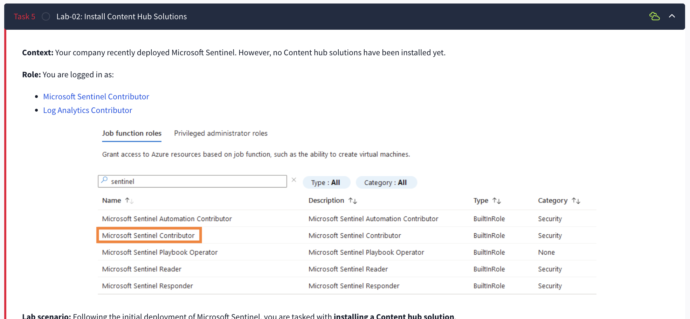

*Figure 1 — Supplied Image 3: The lab instructions identify Microsoft Sentinel Contributor and Log Analytics Contributor as the scenario’s roles. This is instructional context, not proof of actual role assignments.*

The distinction became relevant when the Entra ID connector accepted workspace access but rejected other prerequisites. Access to the Sentinel workspace did not establish permission to configure the identity source.

## 4 Implementation Steps and Evidence

### 4.1 Review the initial connector and Content hub state

The initial material showed an empty connector inventory and a Content hub catalog with no installed solutions. Reviewing this baseline established why solution installation was necessary before configuring the desired connector.

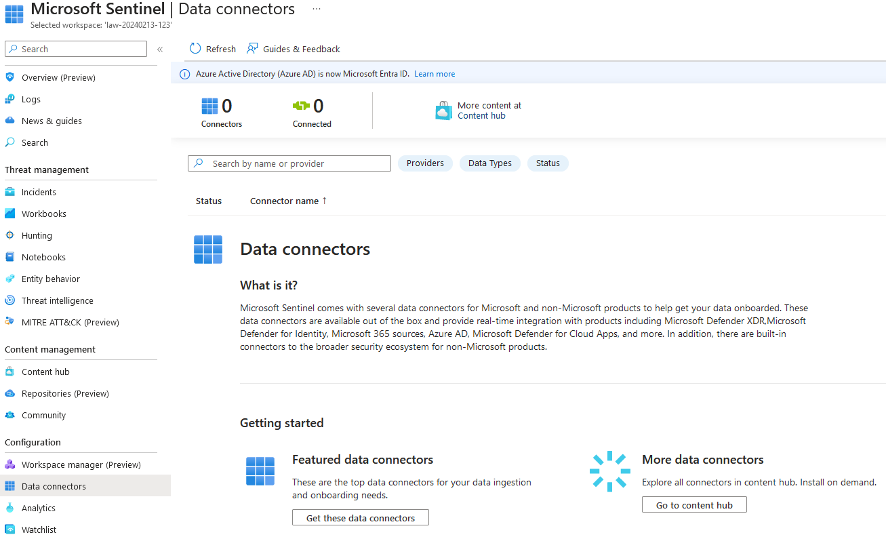

*Figure 2 — Supplied Image 1: The Data connectors page for law-20240213-123 displays zero connectors and zero connected sources. This establishes the state of that captured workspace only.*

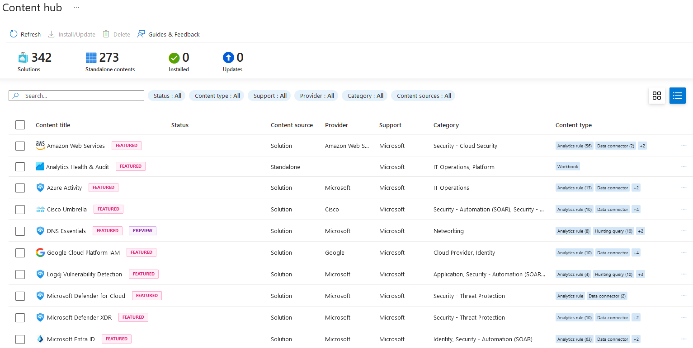

*Figure 3 — Supplied Image 2: Content hub shows zero installed items and lists available solutions, including Microsoft Entra ID. Catalog totals describe this screenshot, not a fixed product inventory.*

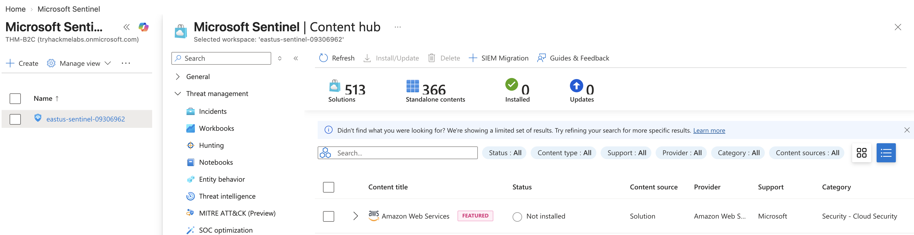

*Figure 4 — Supplied Image 4: Content hub is accessible within Sentinel for eastus-sentinel-09306962, with zero installed items displayed.*

The workspace view supports that Sentinel was available for the lab. It does not show the original action that enabled Sentinel, so initial deployment is treated as a pre-existing condition.

### 4.2 Review and install the Microsoft Entra ID solution

The supplied notes report installation of the Microsoft Entra ID solution. Its solution details describe identity log ingestion through diagnostic settings and list the following packaged content:

| Content type | Displayed quantity |
| --- | --- |
| Analytics content | 74 |
| Data connector | 1 |
| Playbooks | 11 |
| Watchlist | 1 |
| Workbooks | 3 |

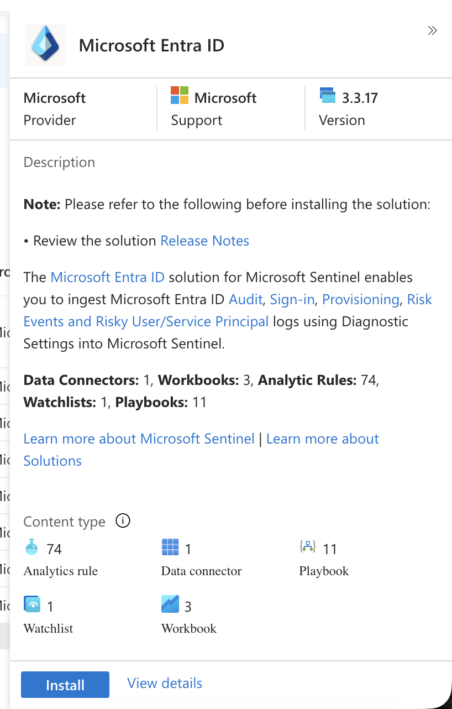

*Figure 5 — Supplied Image 5: Microsoft Entra ID solution version 3.3.17 describes supported identity log categories and packaged content. The visible Install button represents the pre-installation view.*

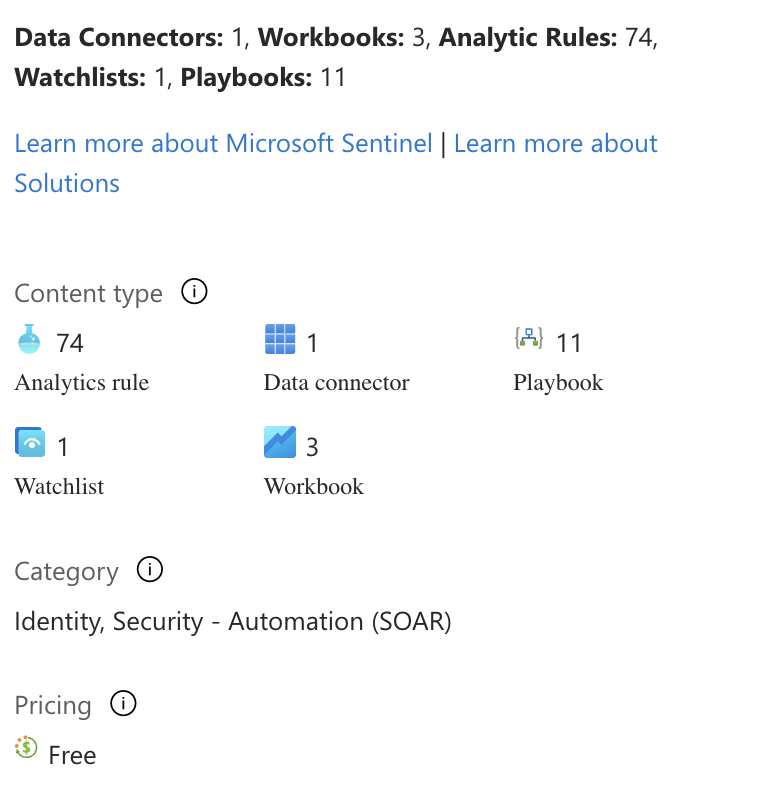

*Figure 6 — Supplied Image 6: Detailed inventory confirms the listed connector, analytics content, playbooks, watchlist, and workbooks. These counts do not demonstrate that individual detections or automation workflows were activated.*

Installing this solution made the Entra ID integration available for subsequent configuration. The package also exposed content relevant to identity monitoring, but no screenshots show analytics rules being enabled, playbooks being executed, or workbooks populated with data.

### 4.3 Confirm connector availability and inspect prerequisites

The subsequent connector inventory displayed Microsoft Entra ID as the available connector, with one connector and zero connected sources.

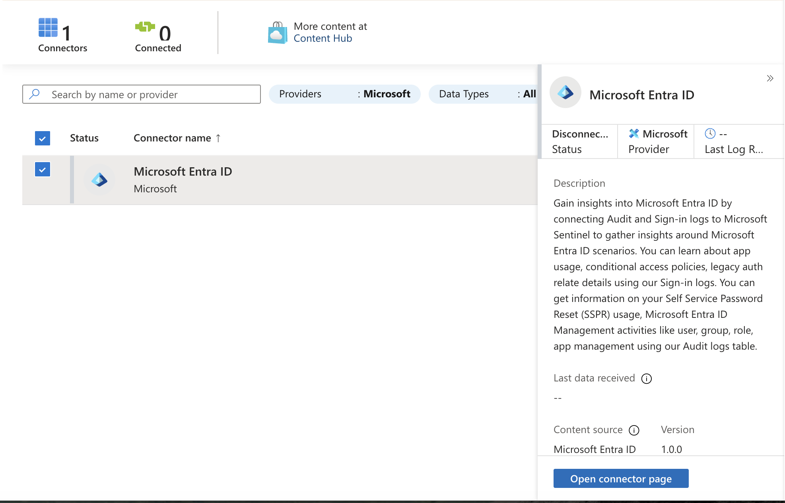

*Figure 7 — Supplied Image 7: Microsoft Entra ID is available in the connector inventory, but its status is disconnected and no last-data-received value is present.*

Opening the connector exposed a permission boundary:

- Workspace read/write access: Passed.

- Microsoft Entra ID diagnostic-settings read/write access: Failed.

- Tenant permissions: Failed; the captured page identifies Global Administrator or Security Administrator.

- Configuration control: Disabled and labeled No permissions.

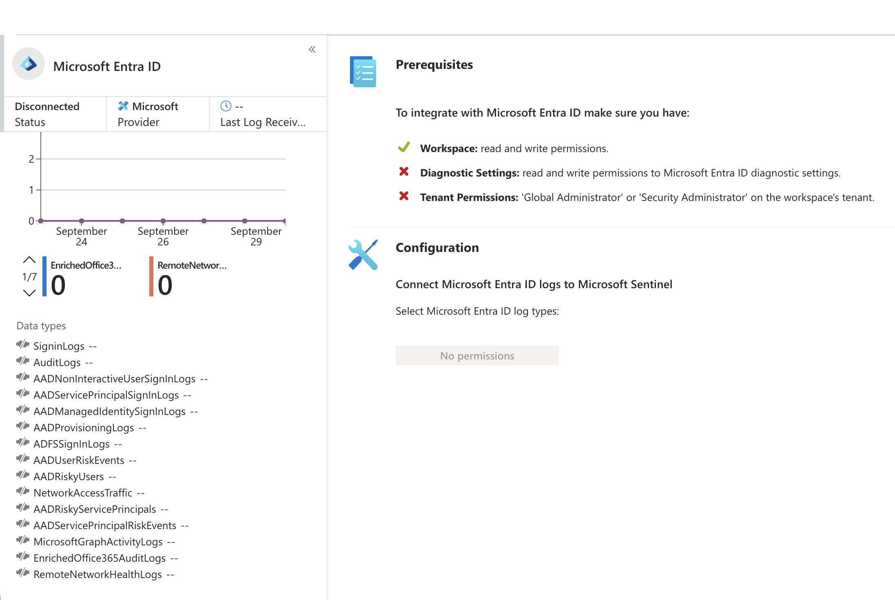

*Figure 8 — Supplied Image 8: The connector remains Disconnected. Workspace permissions pass, while diagnostic-settings and tenant-permission checks fail, preventing log-type configuration.*

Result: Connector installation was supported, but Entra ID log collection was blocked. No supplied evidence shows a permission change, successful reconfiguration, or subsequent identity-log ingestion.

For SOC operations, this distinction matters because identity detections depend on the underlying telemetry. An available connector alone does not establish visibility into sign-ins or directory changes.

### 4.4 Install the threat intelligence solutions

The supplied notes next describe installation of Threat Intelligence (NEW) and Microsoft Defender Threat Intelligence. Both captured solution panels display Manage, consistent with their installed state.

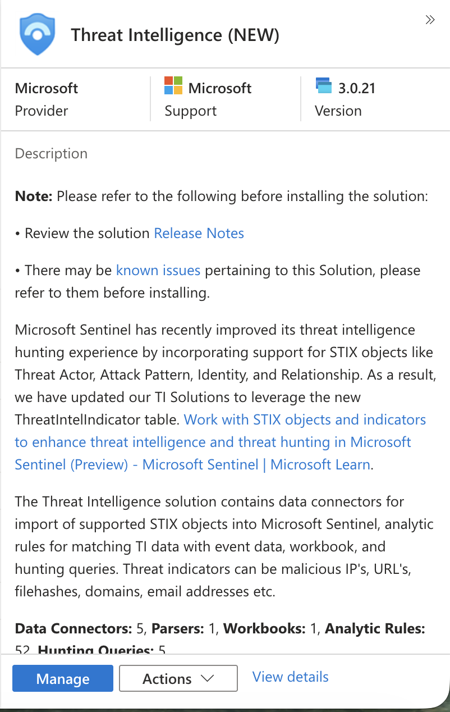

*Figure 9 — Supplied Image 9: Threat Intelligence (NEW), version 3.0.21, displays a Manage control and describes connectors, threat intelligence matching, hunting content, and support for STIX objects.*

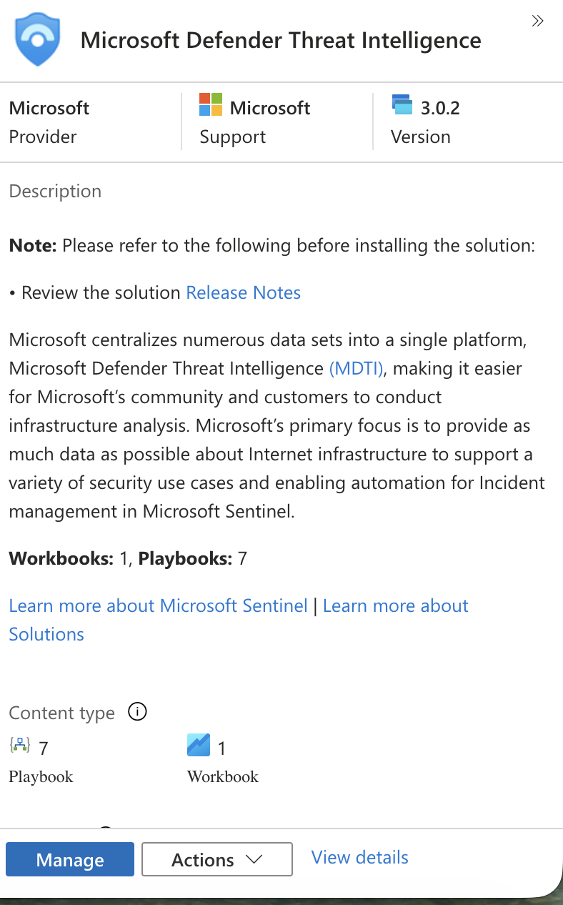

*Figure 10 — Supplied Image 10: Microsoft Defender Threat Intelligence, version 3.0.2, displays a Manage control and lists seven playbooks and one workbook.*

These packages served related but distinct purposes in the supplied material. The Microsoft Threat Intelligence connector identifies Threat Intelligence (NEW) as its content source. The separate MDTI solution shown in Figure 10 lists workbook and playbook content. Its installation should not be treated as evidence that those playbooks were configured or used.

### 4.5 Enable the Microsoft Threat Intelligence connector

The connector’s pre-connection view showed:

- Disconnected status.

- A passing workspace read/write prerequisite.

- All available selected under import indicators.

- A Connect button.

- A description stating that the connector imports MDTI IOCs.

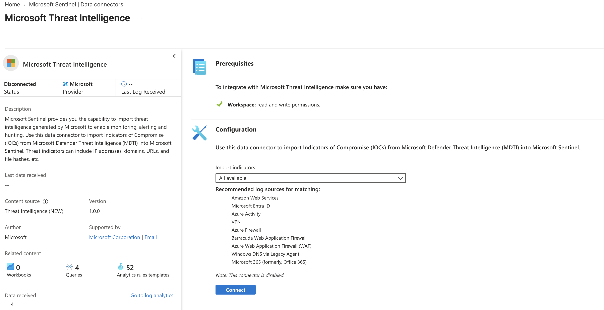

*Figure 11 — Supplied Image 11: Microsoft Threat Intelligence is disconnected, with the workspace prerequisite satisfied and All available selected for indicator import. No data receipt is shown.*

The supplied work reports connecting the source. The subsequent screenshots corroborate activation through a Disconnect control and explicit Connected status.

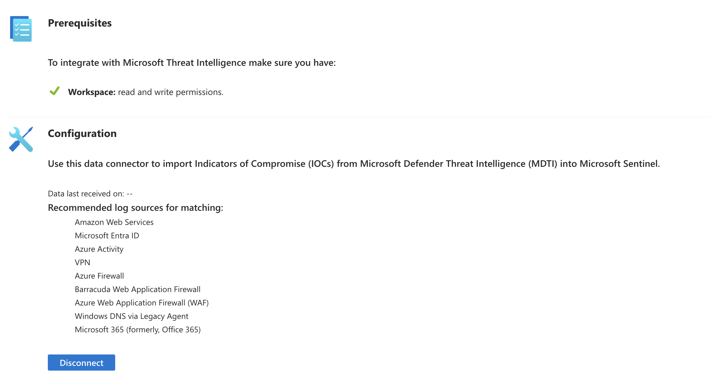

*Figure 12 — Supplied Image 12: The configuration now offers Disconnect, supporting that the connection was enabled. Data last received on still displays --.*

### 4.6 Review post-connection ingestion telemetry

The final views confirmed the connection state while showing no received data in the displayed period.

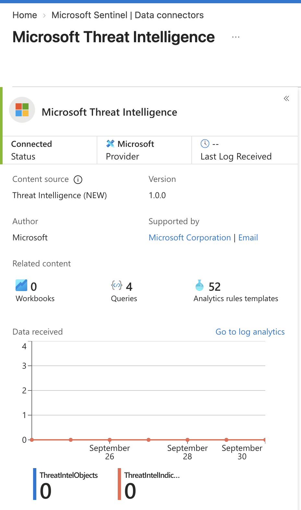

*Figure 13 — Supplied Image 13: Microsoft Threat Intelligence shows Connected, but Last Log Received is -- and the displayed data counters remain zero.*

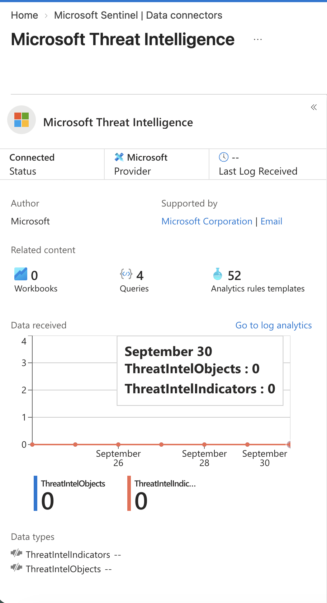

*Figure 14 — Supplied Image 14: The September 30 tooltip reports zero ThreatIntelObjects and zero ThreatIntelIndicators. Both data-type indicators remain gray with -- values.*

The notes describe green data-type indicators as evidence of populated data. That state is not present in the supplied final screenshot. Accordingly, the report confirms activation but does not claim successful ingestion.

## 5 Technical Explanation

### 5.1 Content installation and data collection are separate stages

Content hub delivers the integration and security content associated with a source. A connector then provides the configuration path for collecting that source’s data.

The Entra ID sequence illustrates this separation directly: the connector became available, but missing prerequisites prevented configuration. Packaged analytics content could not substitute for the missing identity telemetry.

### 5.2 Workspace access and source access serve different purposes

The Entra ID connector checks distinguish access to the destination workspace from access to the source’s diagnostic settings and tenant.

This is an operationally important permission boundary. A user may be able to manage Sentinel resources while lacking authority to configure the identity service’s log export. Troubleshooting therefore needs to examine each failed prerequisite rather than assuming that one contributor role grants all required access.

### 5.3 Threat intelligence provides context for matching

The connector description identifies IOCs such as IP addresses, domains, URLs, and file hashes. These represent intelligence that can be compared with observed activity.

The solution description explains the intended relationship: threat intelligence import leads to available intelligence data, which can be matched against event data and used to investigate relevant matches.

The screenshots list recommended matching sources, including Entra ID, Azure Activity, firewall, DNS, and other logs. They do not demonstrate that those sources were connected or that any matching occurred.

An imported indicator is therefore not evidence that an asset in the lab was compromised. Operational telemetry and investigative context would be needed to establish relevance.

### 5.4 Installed templates do not establish operational detection

The connected threat intelligence page lists 52 analytics rule templates and four queries. This demonstrates related content availability, not rule activation or query execution.

Likewise, the solution inventories show playbook and workbook content, but no execution history or populated dashboards. The lab established part of the foundation for detection and automation; it did not demonstrate a complete alerting or response workflow.

## 6 Validation and Results

| Validation area | Supplied evidence | Defensible result |
| --- | --- | --- |
| Sentinel workspace access | Content hub visible in workspace | Interface available; initial enablement not captured |
| Entra ID installation | Notes and connector inventory | Connector availability confirmed |
| Entra ID connection | Disconnected; failed prerequisites | Blocked at configuration |
| Entra ID ingestion | No receipt timestamp; inactive indicators | Not demonstrated |
| Threat Intelligence (NEW) installation | Notes and Manage control | Installation supported |
| MDTI solution installation | Notes and Manage control | Installation supported |
| Threat intelligence activation | Disconnect and Connected | Connection enabled |
| IOC ingestion | Zero counters; no receipt timestamp | Not verified |
| KQL execution | No queries or results shown | Not demonstrated |
| Analytics alerts and incidents | Templates only | Not demonstrated |
| SOAR execution | Packaged playbooks only | Not demonstrated |

The validation performed in the supplied record was portal-based: reviewing connector inventory, prerequisite checks, connection controls, status, and data-received charts. No record-level validation was supplied.

## 7 Issues and Troubleshooting

### 7.1 Entra ID configuration blocked by permissions

Observed issue: The connector remained disconnected and displayed a disabled No permissions control.

Evidence-supported cause: The diagnostic-settings and tenant-permission checks failed while the workspace permission check passed.

Troubleshooting demonstrated: The connector’s prerequisite panel was inspected, identifying the specific access checks that prevented configuration.

Final disposition: Unresolved in the supplied evidence.

Recommended follow-up: Have an authorized administrator review the failed prerequisites and provide appropriately scoped access or perform the source configuration. Then repeat the prerequisite checks and capture successful data receipt. No such remediation is claimed as completed.

### 7.2 Threat intelligence connected without demonstrated data arrival

Observed issue: The connector reached Connected status, but both displayed data series remained zero.

Cause: Undetermined. The screenshots do not establish the time elapsed after activation or show diagnostic errors. Initial ingestion delay, chart refresh timing, or a collection issue are possible explanations, but none is proven.

Troubleshooting demonstrated: Connection controls, status, receipt timestamps, counters, and chart details were reviewed.

Final disposition: Activation confirmed; ingestion validation incomplete.

Recommended follow-up: Recheck the relevant time range and connector telemetry, then inspect the displayed threat intelligence tables through Logs. Capture returned records and timestamps before declaring ingestion successful.

### 7.3 Evidence consistency

Different workspace names and catalog snapshots limit direct before-and-after comparison. Future evidence should retain the selected workspace and capture time so that configuration changes and results can be tied to the same environment.

This is a documentation limitation, not evidence of a connector failure.

## 8 Skills Learned and Their SOC Relevance

| Capability | Evidence demonstrated | SOC application |
| --- | --- | --- |
| Content hub onboarding | Solution review, notes, installed-state controls | Prepare integrations and identify security content |
| Connector lifecycle assessment | Availability versus Connected status | Avoid premature closure of onboarding |
| Permission analysis | Workspace passed; Entra prerequisites failed | Escalate access issues with actionable evidence |
| Threat intelligence activation | Connect changed to Disconnect and Connected | Establish a source for enrichment and matching |
| Ingestion telemetry interpretation | Zero counters, missing timestamps, inactive indicators | Identify visibility gaps |
| Technical evidence interpretation | Separate content, configuration, and data receipt | Produce accurate SOC handovers and reports |

The lab also developed conceptual understanding of IOC matching, identity telemetry, and packaged detection content. Hands-on KQL development, analytics-rule creation, incident investigation, and SOAR execution remain outside the demonstrated scope.

## 9 Key Takeaways

- Solution installation does not prove ingestion. The Entra ID connector was available but remained blocked.

- Permissions must be evaluated at each relevant boundary. Workspace access passed while source-related checks failed.

- Connected status is one validation milestone. The threat intelligence connection was enabled, but its screenshots did not show arriving records.

- Detection depends on usable data. Templates and intelligence feeds require appropriate telemetry and further configuration to produce meaningful results.

- Accurate reporting preserves unresolved outcomes. Zero counters and missing timestamps should remain visible in the conclusion.

## 10 Recommended Next Steps

These are follow-up exercises, not completed lab activities.

- Resolve the Entra ID permission barrier. Repeat the prerequisite checks, configure authorized log categories, and document the resulting connection state.

- Complete ingestion validation. Inspect the relevant tables in Logs and capture records, record counts, and recent timestamps.

- Practice KQL against verified data. Filter by time, inspect representative records, and summarize activity to understand data coverage.

- Test one threat intelligence matching use case. Use an ingested operational source and document the matching fields, time range, and interpretation.

- Create and validate one analytics rule. Review its data dependencies and capture evidence of its enabled state and controlled test results.

- Investigate a resulting alert or incident. Record the evidence, affected entities, reasoning, and disposition.

- Evaluate one packaged playbook. Review its purpose and permissions before a controlled test, then capture its execution result.

- Standardize evidence capture. Include workspace context, timestamps, configuration state, and result evidence for each major step.

## 11 Final Skills Demonstrated

### SOC Analyst interview summary

Demonstrated capabilities:

- Installed and reviewed Microsoft Sentinel Content hub solutions.

- Confirmed Microsoft Entra ID connector availability and identified the permissions preventing configuration.

- Enabled the Microsoft Threat Intelligence connector for MDTI IOC import.

- Assessed connection status separately from ingestion telemetry.

- Documented successful activation, unresolved access issues, and unverified data arrival without overstating results.

### Interview ready explanation

“In this lab, I used Microsoft Sentinel Content hub to onboard identity and threat intelligence content. I confirmed the Entra ID connector was available, then identified that diagnostic-settings and tenant permissions blocked its configuration. I also enabled the Microsoft Threat Intelligence connector and verified its Connected status. During validation, I found that the screenshots still showed zero received indicators and no last-log timestamp, so I recorded ingestion as unverified. The exercise strengthened my ability to separate content installation, connector activation, and actual data availability when assessing SOC monitoring readiness.”
